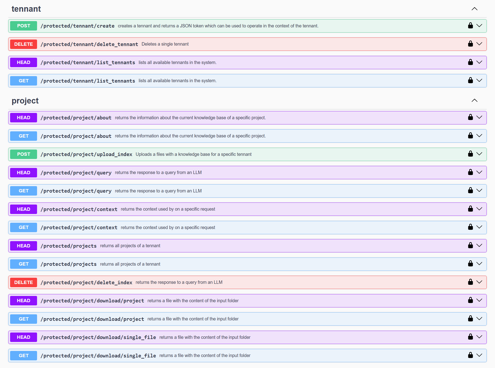

# GraphRag Knowledge Base Engine

Project with support for multi tennant indexing and search functions to create the knowledge graphs and the embeddings that can be used for GraphRAG.
It also provides a simple API to expose GraphRAG as an API.

The tennant API has three main methods:

- Upload a zip file with the knowledge base
- Perform local, global and drift queries on an existing knowledge base
- Retrieve the GraphRAG context based on a question
- Delete a specific index or project

# Install

In the project folder execute:

```bash
uv venv
# Under Windows
# .venv\Scripts\activate
source .venv/bin/activate
uv sync
```

# Configuration

The application is configured used environment variables which you can set in a `.env` file.

And example with all variables can be found here:

[.env_local](.env_local)

The most important variables are:

```
# The Open API key
OPENAI_API_KEY

# The directory with the text files with the knowledge base.
DOCS_DIR

# The directory where the whole GraphRAG files are stored after generation
GRAPHRAG_ROOT_DIR

# The director where the vectors are stored
STORAGE_BASE_DIR

# Whether claims are turned on or not
CLAIMS_ENABLED=false
```

# How the system works

This is a Knowledge Base service which supports multiple tennants with multiple projects each. You have two roles:

- Administrators: administrators can manage tennants
- Tennants: tennants can manage projects

A tennant will create a project when he/she uploads a file that is indexed. After the project has been created the tennant can query it or use its extracted context.

The whole authentication system is based on tokens. The administrator will have his/her own token as well as the tennant.

In order to promote a user to an administrator you will to create a token for the administrator (see next chapter) and then you need to add his / her email to the file:

[./config/administration.yaml](./config/administration.yaml)

An example of this file can be found here:

[./config/administration_local.yaml](./config/administration_local.yaml)

# Creating the administration token

In order to create tennants via the API you will need to create an administration token first. The administrator is the one who can create tennants and therefore needs a token.

Before running this command make sure that the .env is available and the CONFIG_DIR environment variable points to the config folder.

This is the command that allows to generate the administration token:

```bash
# Under Windows
# .venv\Scripts\activate
source .venv/bin/activate
python ./graphrag_kb_server/cli/jwt_main.py "<name>" "<email>"
```

This will produce a file admin_token.md with the token.

The administration token should be also inserted into the .env file (ADMIN_JWT variable)

# Running the server

Before running the server, build the front end first. See the instructions below.

```bash
python ./graphrag_kb_server/main/webapp.py
```

## Swagger UI

Please open to see the exposed API and its parameters:

http://127.0.0.1:9999/docs

Here is a brief screenshot of the methods in the Swagger API:



## Install the server as a service in Linux

You can use the file graph_kb_server_sample.service as a template for installing a service in Linux using systemd.

The installation commands are typically:

```bash
sudo cp *.service /etc/systemd/system/
sudo systemctl enable graphrag_kb_server.service
sudo systemctl start graphrag_kb_server.service
sudo systemctl status graphrag_kb_server.service
```

## Building the front end

You will need node version 18 or later for this.

You can build the front-end using this command:

```bash
# Under Windows
# .venv\Scripts\activate
source .venv/bin/activate
uv run ./graphrag_kb_server/cli/build_web.py
```

Alternatively you can build the UI by running these commands:

```bash
cd front_end
yarn run build
```

You can also use npm instead of yarn.

Also change the file [front_end/server.js](front_end/server.js) so that the UI is linked to your server domain.

So change:

```js
export const BASE_SERVER = "http://localhost:9999"
```

to 

```js
export const BASE_SERVER = "https://yourdomain.com"
```

## Starting the front end

To start the front end in development mode:

```bash
cd front_end
yarn run dev
```

Make sure to start the server with the command below.

You can access it via: http://localhost:1234/index

To start the front end in production mode in the root folder of the project:

```bash
uv run ./graphrag_kb_server/main/webapp.py
```

You can access it via: http://localhost:9999/index


